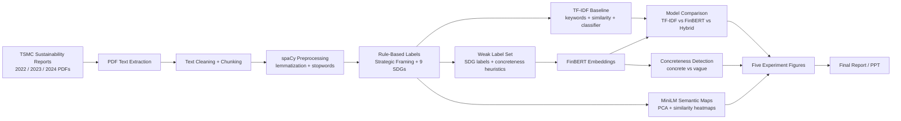
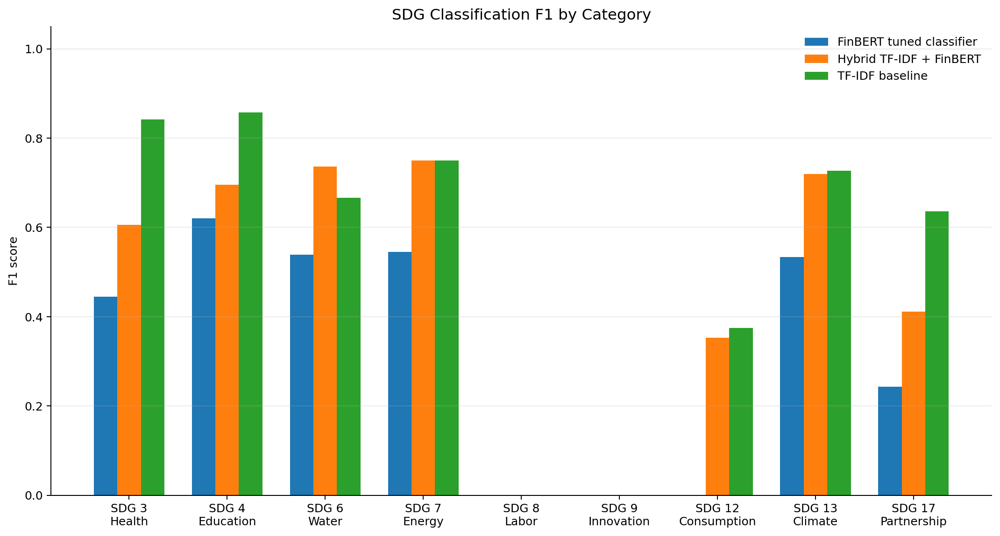
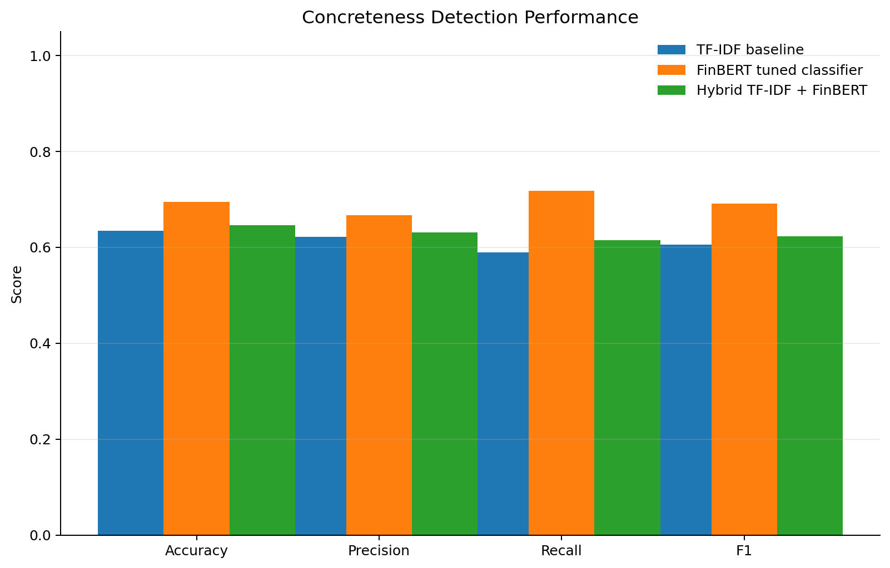
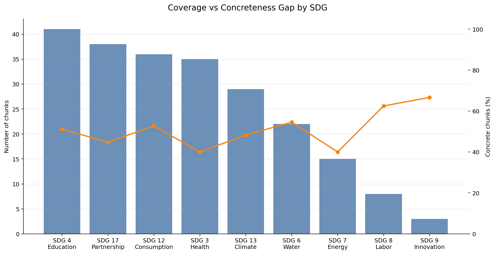
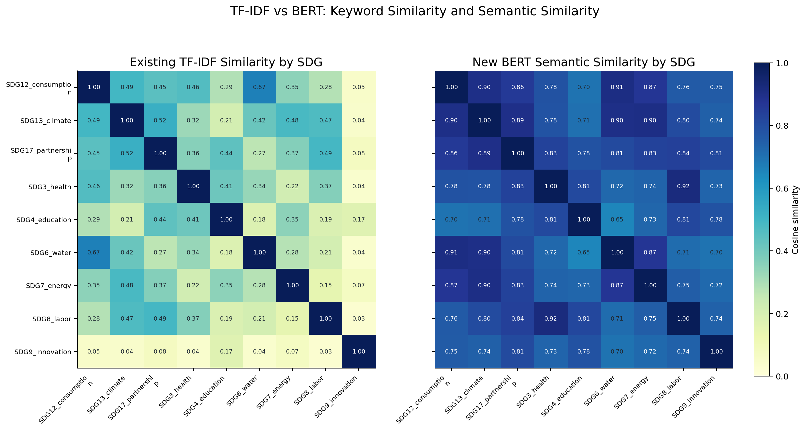
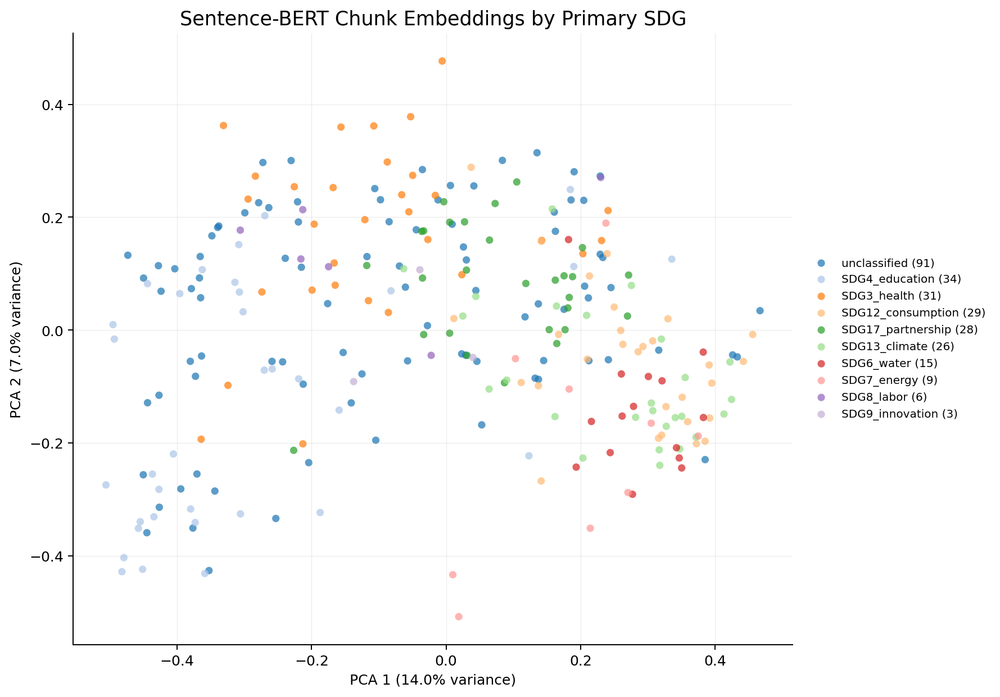

# BERT / FinBERT Experiment Results

## Project Summary

This project analyzes TSMC sustainability reports using text mining. The goal is to understand how TSMC frames ESG issues, how its language aligns with UN Sustainable Development Goals, and whether the report language describes measurable action or mostly aspirational commitments.

The project combines:

- TF-IDF keyword analysis
- rule-based SDG labeling
- multi-year report processing
- BERT-family semantic embeddings
- FinBERT classification experiments
- concreteness detection for ESG accountability

## Research Question

> How does TSMC's ESG language align with UN SDGs, and does that language reflect concrete action or vague sustainability rhetoric?

## Method Overview

We selected FinBERT as the main BERT-family model because it is adapted to financial and corporate disclosure language. We used it to generate semantic embeddings for ESG report chunks, then trained lightweight classifiers for SDG prediction and concreteness detection.

We also used MiniLM sentence embeddings to create semantic maps and similarity heatmaps for dashboard interpretation.

## Pipeline



## Model Setup

The experiment compares three approaches:

| Model | Purpose |
|---|---|
| TF-IDF baseline | Represents the mid-term keyword-based method |
| FinBERT tuned classifier | Uses corporate-language semantic embeddings |
| Hybrid TF-IDF + FinBERT | Combines keyword evidence and semantic evidence |

The SDG classifier is multi-label because each chunk can align with more than one SDG. The script tunes a separate threshold for each SDG using validation data.

The script now reports four SDG F1 views:

- **Macro F1**: treats every SDG equally; strictest for small classes.
- **Micro F1**: pools all label decisions; more stable for imbalanced data.
- **Weighted F1**: weights each SDG by support.
- **Macro F1 excluding SDG 8 and SDG 9**: a diagnostic view because those two labels have very low test support in the 2024-only run.

## Labeling Note

The current metrics use weak labels, not final human gold labels.

SDG weak labels come from the existing rule-based SDG pipeline. Concreteness weak labels are generated from transparent features such as numbers, dates, units, action verbs, and vague future-oriented words.

This is appropriate for a pilot experiment, but the final project should manually validate a sample of chunks.

## Outputs

The main outputs are:

- `outputs/finbert_vs_tfidf_sdg_f1_scores.csv`
- `outputs/concreteness_detection_metrics.csv`
- `outputs/coverage_concreteness_by_sdg.csv`
- `outputs/sdg_tuned_thresholds.csv`
- `outputs/bert_experiment_model_summary.csv`
- `outputs/weak_eval_labels.csv`

For multi-year evaluation, the script writes parallel files with `_multiyear`, for example:

- `outputs/weak_eval_labels_multiyear.csv`
- `outputs/finbert_vs_tfidf_sdg_f1_scores_multiyear.csv`
- `outputs/bert_experiment_model_summary_multiyear.csv`
- `pic/finbert_vs_tfidf_sdg_f1_multiyear.png`

## Five Selected Pictures

### Picture 1: SDG Classification F1



This figure compares TF-IDF, FinBERT, and the hybrid model across the 9 SDGs. It directly answers the assignment requirement for FinBERT F1 and TF-IDF baseline F1.

Interpretation:

> TF-IDF is strong when the weak labels are keyword-derived, while FinBERT and the hybrid model add semantic evidence. If the hybrid model performs best after rerunning, it suggests keyword and semantic features are complementary.

### Picture 2: Concreteness Detection Accuracy



This figure compares model performance on detecting concrete vs vague ESG language.

Interpretation:

> Concreteness is more contextual than SDG keyword matching. FinBERT is useful because it can represent sentence meaning, not only exact terms.

### Picture 3: Coverage vs Concreteness Gap



This figure compares how often each SDG appears with how concrete those chunks are.

Interpretation:

> High SDG coverage does not automatically mean strong accountability. This supports the project's greenwashing-related question.

### Picture 4: TF-IDF vs BERT SDG Similarity



This figure compares keyword-based similarity and semantic similarity between SDGs.

Interpretation:

> TF-IDF captures shared vocabulary, while BERT captures semantic closeness. Differences between the two views reveal where vocabulary and meaning do not perfectly align.

### Picture 5: BERT SDG Embedding Map



This figure maps ESG report chunks into a 2D semantic space using BERT-style sentence embeddings.

Interpretation:

> The map shows whether chunks with similar SDG labels occupy related semantic regions. It also helps identify overlapping ESG themes.

## How This Improves the Mid-Term Project

The mid-term project focused on TF-IDF and keyword-based analysis. This final-project progress adds:

- BERT-family model selection and justification
- semantic embeddings
- FinBERT vs TF-IDF evaluation
- SDG-level F1 comparison
- concreteness detection
- coverage vs accountability analysis
- multi-year integration from Zoe's branch

## Current Findings

Latest run:

```powershell
python src/finbert_weak_label_evaluation.py
```

### SDG Classification

| Model | Macro F1 | Micro F1 | Weighted F1 | Macro F1 excluding SDG 8/9 |
|---|---:|---:|---:|---:|
| TF-IDF baseline | 0.5394 | 0.6870 | 0.6674 | 0.6935 |
| FinBERT tuned classifier | 0.3251 | 0.3898 | 0.4003 | 0.4179 |
| Hybrid TF-IDF + FinBERT | 0.4748 | 0.5732 | 0.5692 | 0.6105 |

Interpretation:

> TF-IDF performs best for SDG classification because the current weak SDG labels are generated from keyword rules. The hybrid model improves substantially over pure FinBERT by combining keyword evidence with semantic embeddings. SDG 8 and SDG 9 have only two test examples each, so their F1 scores are unstable and pull down the all-SDG macro average.

### Concreteness Detection

| Model | Accuracy | Precision | Recall | F1 |
|---|---:|---:|---:|---:|
| TF-IDF baseline | 0.6341 | 0.6216 | 0.5897 | 0.6053 |
| FinBERT tuned classifier | 0.6951 | 0.6667 | 0.7179 | 0.6914 |
| Hybrid TF-IDF + FinBERT | 0.6463 | 0.6316 | 0.6154 | 0.6234 |

Interpretation:

> FinBERT performs best on concreteness detection. This supports the argument that BERT-family models are useful for contextual tasks such as distinguishing measurable action from vague ESG language.

Suggested reporting language:

> In the pilot evaluation, TF-IDF remains strongest for SDG classification because the current weak SDG labels are keyword-derived. However, FinBERT performs best on concreteness detection, which is more contextual. The hybrid model shows that keyword and semantic features are complementary, especially for SDGs with enough examples.

## Multi-Year Extension

Zoe's branch adds processed outputs for 2022, 2023, and 2024. The FinBERT evaluation now supports those years together:

```powershell
python src/finbert_weak_label_evaluation.py --multi-year
```

This creates a larger weak-label dataset:

| Year | Chunks |
|---|---:|
| 2022 | 229 |
| 2023 | 220 |
| 2024 | 272 |
| Total | 721 |

Multi-year weak-label SDG counts:

| SDG | Weak-label count |
|---|---:|
| SDG 3 Health | 96 |
| SDG 4 Education | 101 |
| SDG 6 Water | 51 |
| SDG 7 Energy | 36 |
| SDG 8 Labor | 30 |
| SDG 9 Innovation | 14 |
| SDG 12 Consumption | 93 |
| SDG 13 Climate | 85 |
| SDG 17 Partnership | 90 |

Why this matters:

> The 2024-only evaluation has very small support for SDG 8 and SDG 9. Multi-year evaluation increases the number of examples and should make F1 scores more stable. It also connects the BERT experiment directly to the final dashboard's multi-year direction.

The full multi-year FinBERT run may take longer on CPU because it embeds 721 chunks. The script caches the result as `outputs/finbert_embeddings_multiyear.npy`, so it only needs to compute embeddings once.

## Limitation

These results are pilot results. The weak labels are useful for development and comparison, but a final evaluation should use manually verified labels.

## Next Step

To strengthen the final submission, manually validate 50 to 100 sampled chunks:

- correct the SDG labels
- mark concrete vs vague
- rerun the same script
- compare weak-label performance with human-validated performance

This would make the evaluation more credible and improve the final presentation.
