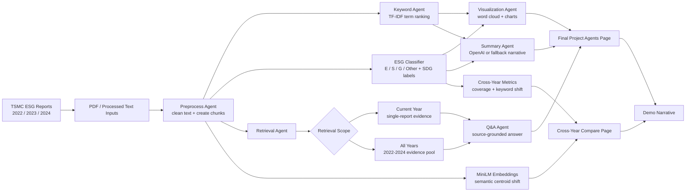

# TSMC ESG Text Mining Dashboard

An interactive Streamlit dashboard for analyzing how TSMC communicates ESG topics across its 2022, 2023, and 2024 sustainability reports.

The project combines a rule-based text-mining pipeline, cross-year comparison tools, semantic embeddings, and a LangGraph-style agent workflow for report summarization and source-grounded Q&A.

## Highlights

- Multi-year ESG report analysis for 2022, 2023, and 2024.
- Strategic Framing and UN SDG classification for report chunks.
- TF-IDF keyword analysis, similarity heatmaps, word clouds, and representative evidence chunks.
- MiniLM sentence embeddings for semantic exploration.
- Cross-Year Compare page for topic coverage, keyword shifts, and semantic centroid movement.
- Final Project Agents page with live agent execution narration, optional OpenAI-powered summaries, and single-year or cross-year Q&A.
- Coursework Archive pages preserved for earlier assignments and supporting analysis.

## App Pages

The sidebar is organized into two sections.

### Final Demo

- **Final Project Agents**: LangGraph-style ESG analysis workflow with live agent narration, AI summary, source-grounded Q&A, word cloud, ESG distribution, and evidence details.
- **Cross-Year Compare**: Three-year comparison of SDG topics using coverage changes, keyword turnover, semantic shift, and grounded narrative summaries.

### Coursework Archive

- **Project Overview**: Project pitch and high-level framing.
- **Methods**: Pipeline walkthrough.
- **Analysis**: Strategic Framing / UN SDG analysis, validation heatmaps, and embedding explorer.
- **Kiwi's Week9 Q1**: Phrase mining, co-occurrence networks, TF-IDF clustering, and context exploration.
- **Kiwi's Week10 Q2**: Word2Vec exploration and semantic group comparison.
- **Week 13 Agent**: Earlier agent workflow prototype.

## Quick Start

Install dependencies:

```bash
pip install -r requirements.txt
python -m spacy download en_core_web_sm
```

Run the Streamlit app:

```bash
streamlit run app.py
```

The root `app.py` is the current dashboard entry point. The legacy `app/streamlit_app.py` only shows a compatibility notice.

## Optional OpenAI Setup

The dashboard works without an API key by using deterministic fallback summaries and evidence snippets.

To enable LLM summaries and answers locally, create an ignored local env file:

```bash
OPENAI_API_KEY="sk-..."
```

For Streamlit Community Cloud, use app secrets:

```toml
OPENAI_API_KEY = "sk-..."
```

The app reads the sidebar key first. If the sidebar is empty, it falls back to Streamlit secrets.

## Regenerating Outputs

The repository already includes processed outputs used by the app. To regenerate them from source PDFs:

```bash
python main.py --audit
```

Expected raw PDFs live under `data/raw/`. The pipeline writes per-year outputs under:

```text
outputs/2022/
outputs/2023/
outputs/2024/
```

Cross-year snapshots are stored as:

```text
outputs/cross_year_analysis.json
outputs/cross_year_analysis.md
```

To regenerate only the cross-year comparison snapshot:

```bash
python cross_year_analysis.py
```

## Project Structure

```text
.
├── app.py                    # Main Streamlit dashboard
├── main.py                   # Multi-year pipeline runner
├── cross_year_analysis.py    # Cross-year metrics and cached snapshot generation
├── agents/                   # LangGraph-style agent modules
│   ├── graph.py              # Agent orchestration
│   ├── llm.py                # OpenAI / fallback generation
│   ├── retrieve.py           # Single-year and cross-year retrieval
│   └── ...
├── app_pages/                # Dashboard pages
│   ├── final_project_agents.py
│   ├── cross_year_panel.py
│   ├── analysis.py
│   ├── methods.py
│   └── ...
├── src/                      # Core NLP pipeline and experiments
├── outputs/                  # Processed CSV/JSON/embedding outputs
├── mds/                      # Supporting experiment notes
├── pic/                      # Figures used by coursework pages
├── records/                  # Assignment/proposal PDFs
└── requirements.txt
```

## Agent Workflow

The Final Project Agents page runs the workflow as visible steps:

1. Preprocess Agent loads the selected report year and prepares chunks.
2. Keyword Agent ranks the most distinctive terms.
3. ESG Classifier assigns Environmental, Social, Governance, or Other labels.
4. Visualization Agent prepares word cloud and chart payloads.
5. Summary Agent writes a presentation-ready narrative using OpenAI when available, otherwise deterministic fallback.
6. Retrieval Agent finds relevant source chunks for a user question.
7. Q&A Agent answers from retrieved evidence only.

Q&A can search either the current report year or all years from 2022 to 2024.

## Mermaid Flowchart



## Recommended Demo Flow

1. Open **Final Project Agents** and run the LangGraph analysis.
2. Show the live agent narration as the workflow executes.
3. Point out the word cloud, ESG distribution, AI insight summary, and evidence details.
4. Ask a single-year question.
5. Switch Q&A retrieval scope to **All years (2022-2024)** and ask a cross-year question.
6. Open **Cross-Year Compare** to show structured year-over-year metrics.
7. Use **Coursework Archive** pages only if the audience asks for earlier assignment evidence.

## Notes

- `.streamlit/secrets.toml`, `.env.example`, logs, caches, and generated experiment artifacts are ignored by Git.
- `outputs/legacy/` is retained for older coursework pages.
- The app is designed to remain usable without OpenAI quota or network access by falling back to deterministic outputs.

