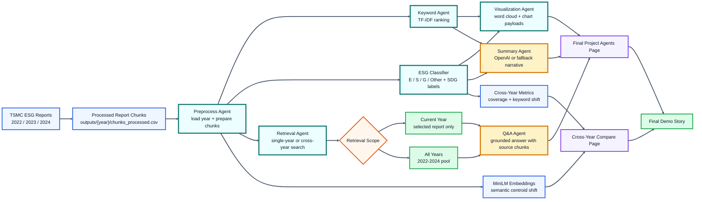

# TSMC ESG Text Mining Dashboard

An interactive text-mining and agent dashboard for exploring how TSMC communicates ESG topics across its 2022, 2023, and 2024 sustainability reports.

The project turns long ESG reports into searchable, visual, and explainable evidence. It combines a traditional NLP pipeline with a LangGraph-style multi-agent workflow, so users can inspect keywords, ESG categories, semantic shifts, cross-year changes, and source-grounded Q&A from one Streamlit app.

## What This Project Does

This project answers one core question:

> How does TSMC's sustainability language change across topics and across years?

To answer that, the system:

1. Loads processed ESG report chunks for 2022, 2023, and 2024.
2. Cleans and chunks report text into analyzable units.
3. Labels each chunk by ESG category and UN SDG theme.
4. Extracts representative keywords using TF-IDF.
5. Computes similarity and semantic embedding views.
6. Builds cross-year metrics for topic coverage, keyword shifts, and semantic movement.
7. Uses an agent workflow to summarize findings and answer questions with cited evidence.

The app is designed around the final project demo. The main story is a multi-agent ESG analysis workflow plus a cross-year comparison module that explains how topic emphasis changes over time.

## Key Features

- **Multi-year analysis**: compares 2022, 2023, and 2024 TSMC sustainability reports.
- **ESG classification**: assigns chunks to Environmental, Social, Governance, or Other.
- **UN SDG mapping**: maps report language to 9 SDG-related themes.
- **TF-IDF keyword mining**: surfaces the most distinctive terms by section and SDG.
- **Semantic embeddings**: uses MiniLM sentence embeddings to compare chunk meaning.
- **Cross-year comparison**: tracks topic coverage, persistent/new/dropped keywords, and semantic centroid shift.
- **LangGraph-style agent workflow**: runs named agents for preprocessing, keywords, ESG classification, visualization, summary, retrieval, and Q&A.
- **OpenAI optional**: uses OpenAI for polished summaries and answers when a key is available; otherwise falls back to deterministic evidence output.
- **Live agent narration**: shows the agent workflow running step by step during the demo.
- **Demo-first layout**: keeps the final workflow, cross-year comparison, source evidence, and AI/fallback behavior easy to present.

## How It Works

The project has two connected layers.

### 1. Text-Mining Pipeline

The pipeline prepares the report data:

- PDF/text extraction and cleanup.
- Paragraph-level chunking.
- Rule-based ESG and SDG labeling.
- TF-IDF keyword extraction.
- Cosine similarity matrices.
- MiniLM sentence embeddings.
- Per-year output files under `outputs/{year}/`.

This layer is deterministic and reproducible. It gives the dashboard stable data even when no API key is available.

### 2. Agent Layer

The agent layer sits on top of the processed data:

- **Preprocess Agent** loads the selected year and prepares chunks.
- **Keyword Agent** ranks important terms.
- **ESG Classifier** summarizes category counts.
- **Visualization Agent** prepares chart payloads.
- **Summary Agent** writes a narrative using OpenAI or fallback logic.
- **Retrieval Agent** searches source chunks for a question.
- **Q&A Agent** answers only from retrieved evidence.

The agent orchestration follows a LangGraph-style design in `agents/graph.py`. The Streamlit page also exposes the workflow as a live execution trace so the demo audience can see the system working step by step.

## Final Demo Pages

The final demo focuses on two pages.

### Final Project Agents

This is the main agent dashboard. It turns one selected report year into a complete ESG intelligence view.

What it shows:

- Live agent narration while the workflow runs.
- Metric cards for source year, chunk count, keyword count, and dominant ESG theme.
- Keyword word cloud for the selected report.
- ESG distribution donut chart.
- AI insight summary generated by OpenAI when available, or deterministic fallback when no key is available.
- Source-grounded report Q&A.
- Q&A retrieval scope selector:
  - **Current report year**: answer from the selected year only.
  - **All years (2022-2024)**: answer from a pooled multi-year evidence base.
- Evidence expanders showing source chunks, year tags, chunk ids, and retrieval scores.
- Agent execution trace summarizing observable outputs from each step.

### Cross-Year Compare

This page explains how an SDG topic changes across 2022, 2023, and 2024.

What it shows:

- Topic coverage by year.
- Absolute and percentage-point change from 2022 to 2024.
- Persistent keywords that appear across all years.
- Newly prominent keywords by 2024.
- Dropped keywords that fade out by 2024.
- Semantic centroid shift using MiniLM embeddings.
- A grounded cross-year narrative that describes what changed without inventing motives.

Together, these two pages support the final presentation: one page shows the agent workflow, and the other shows structured year-over-year evidence.

## Technology Stack

### App and UI

- **Streamlit**: interactive dashboard and deployment target.
- **Plotly**: interactive charts and donut charts.
- **Matplotlib + WordCloud**: word cloud rendering.
- **streamlit-echarts**: additional interactive visualization support.

### NLP and Data Processing

- **pandas / numpy**: data wrangling and numerical processing.
- **spaCy**: tokenization, lemmatization, and preprocessing.
- **scikit-learn**: TF-IDF, cosine similarity, PCA, and clustering utilities.
- **pdfplumber**: PDF text extraction.
- **sentence-transformers**: MiniLM sentence embeddings.
- **gensim**: Word2Vec support for supplemental semantic exploration.
- **networkx / pyvis**: keyword co-occurrence networks.

### Agent and LLM Layer

- **LangGraph**: graph-style agent workflow structure.
- **langchain-openai**: LangChain wrapper for OpenAI chat calls.
- **openai**: OpenAI SDK fallback path.
- **python-dotenv**: local environment variable loading.

The app remains usable without OpenAI access. If no API key is detected, summaries and Q&A fall back to deterministic evidence-based output. This is important for demo reliability: the dashboard still works if the API key is missing, quota is exhausted, or the model call fails.

## Final Agent Workflow In Detail

The final agent page uses a visible, step-by-step workflow. Each step updates the UI so the audience can see the system progressing through the analysis.

| Step | Agent | What It Does | Output Shown In The App |
|---|---|---|---|
| 1 | **Preprocess Agent** | Loads the selected year and prepares report chunks. | Source year and chunk count. |
| 2 | **Keyword Agent** | Ranks distinctive terms using TF-IDF-style keyword scoring. | Keyword count, top terms, and word cloud. |
| 3 | **ESG Classifier** | Assigns chunks to Environmental, Social, Governance, or Other. | ESG counts and dominant ESG theme. |
| 4 | **Visualization Agent** | Builds chart-ready payloads from keywords and classifications. | Word cloud and ESG distribution chart. |
| 5 | **Summary Agent** | Writes a presentation-ready narrative. | AI insight summary. |
| 6 | **Retrieval Agent** | Searches source chunks for the user's question. | Retrieved chunks with year, id, score, and text. |
| 7 | **Q&A Agent** | Answers using only retrieved evidence. | Grounded answer plus source chunks. |

The Summary and Q&A agents use OpenAI when a key is available. Otherwise, they return deterministic fallback output based on the already-computed data and retrieved evidence.

## Cross-Year Method

The cross-year module compares SDG topics across 2022, 2023, and 2024. It does not simply ask an LLM to summarize three reports. Instead, it computes structured metrics first, then optionally asks the LLM to explain those metrics.

The comparison uses:

- **Coverage**: how many chunks mention a topic in each year, and what share of that year's report it represents.
- **Keyword shift**: which terms stay persistent, newly appear, or drop out by 2024.
- **Semantic shift**: how far a topic's average embedding moves between years.
- **Grounded narrative**: a concise explanation constrained to the computed metrics.

This keeps the cross-year story auditable. The LLM can improve wording, but the evidence comes from the computed metrics.

## Quick Start

Install dependencies:

```bash
pip install -r requirements.txt
python -m spacy download en_core_web_sm
```

Run the dashboard:

```bash
streamlit run app.py
```

The current app entry point is **`app.py`** at the project root. The legacy **`app/streamlit_app.py`** is kept only as a compatibility notice.

## OpenAI API Key

The app checks for an OpenAI key in this order:

1. Key typed into the Streamlit sidebar.
2. `st.secrets["OPENAI_API_KEY"]` on Streamlit Cloud.
3. Local environment variable loaded through `.env` / dotenv.

For Streamlit Community Cloud, add this to app secrets:

```toml
OPENAI_API_KEY = "sk-..."
```

For a public demo, use a separate OpenAI project key with a low budget limit, or ask users to provide their own key in the sidebar.

## Regenerating Data

The repository already includes processed outputs used by the dashboard. To regenerate outputs from source reports:

```bash
python main.py --audit
```

This writes per-year results to:

```text
outputs/2022/
outputs/2023/
outputs/2024/
```

To regenerate the cross-year snapshot:

```bash
python cross_year_analysis.py
```

Cross-year files:

- **`outputs/cross_year_analysis.json`**: cached data used by the app.
- **`outputs/cross_year_analysis.md`**: human-readable cross-year report.

## Project Structure

### Top-Level Files

- **`app.py`**: main Streamlit dashboard and sidebar routing.
- **`main.py`**: multi-year pipeline runner for 2022, 2023, and 2024.
- **`cross_year_analysis.py`**: generates cross-year metrics and cached snapshots.
- **`requirements.txt`**: deployment/runtime Python dependencies.
- **`runtime.txt`**: Python runtime hint for deployment.
- **`README.md`**: current project documentation.
- **`readme_old.md`**: preserved README backup.

### Top-Level Folders

- **`agents/`**: LangGraph-style agent modules.
  - **`graph.py`**: orchestrates analysis and Q&A workflows.
  - **`llm.py`**: OpenAI calls and deterministic fallback summaries.
  - **`retrieve.py`**: single-year and cross-year TF-IDF retrieval.
  - **`corpus.py`**: multi-year chunk loading.
  - **`preprocess.py`**, **`keywords.py`**, **`classify.py`**, **`visualize.py`**: individual agent steps.

- **`app_pages/`**: Streamlit page modules.
  - **`final_project_agents.py`**: final demo agent dashboard.
  - **`cross_year_panel.py`**: cross-year comparison page.
  - **`analysis.py`**, **`methods.py`**, **`project_overview.py`**: supporting analysis and methodology pages.
  - **`week9_q1.py`**, **`week10_q2.py`**, **`week13_agent.py`**: supplemental exploration pages.

- **`src/`**: core NLP pipeline and experiment scripts.
  - **`pipeline.py`**: report processing, labeling, TF-IDF, and per-year output generation.
  - **`extract_pdf.py`**: PDF extraction.
  - **`embeddings.py`**: MiniLM embedding generation.
  - **`agent_tools.py`**: tool-style wrappers for agent experiments.
  - **`bert_experiments.py`**, **`finbert_weak_label_evaluation.py`**: model experiments.

- **`outputs/`**: processed data used by the dashboard.
  - **`2022/`**, **`2023/`**, **`2024/`**: per-year processed chunks, TF-IDF tables, similarity matrices, and embeddings.
  - **`cross_year_analysis.json`** and **`cross_year_analysis.md`**: cached cross-year comparison data.
  - **`legacy/`**: older outputs retained for compatibility.

- **`data/`**: source data folder. Raw PDFs should live under **`data/raw/`**.

- **`mds/`**: supporting markdown notes for BERT, Week 13, and experiment plans/results.

- **`pic/`**: generated figures and screenshots used by supporting pages.

- **`records/`**: assignment PDFs and proposal records.

- **`app/`**: legacy Streamlit entry point kept for compatibility.

## Mermaid Flowchart



## Recommended Demo Flow

1. Open **Final Project Agents**.
2. Run the LangGraph analysis and show the live agent narration.
3. Explain the metric cards, word cloud, and ESG distribution.
4. Show the AI insight summary and mention OpenAI/fallback behavior.
5. Ask a single-year question and open the retrieved source chunks.
6. Switch Q&A retrieval scope to **All years (2022-2024)** and ask a cross-year question.
7. Open **Cross-Year Compare** to show structured year-over-year evidence.
8. Close by explaining that the final answer is grounded in computed metrics and retrieved chunks, not unsupported generation.

## Notes

- The app is safe to run without an API key.
- `.streamlit/secrets.toml`, `.env.example`, logs, caches, and large generated artifacts are ignored by Git.
- The public deployment should use Streamlit secrets or sidebar API input instead of committing API keys.
- Some legacy outputs are intentionally retained so older supporting views still load.
