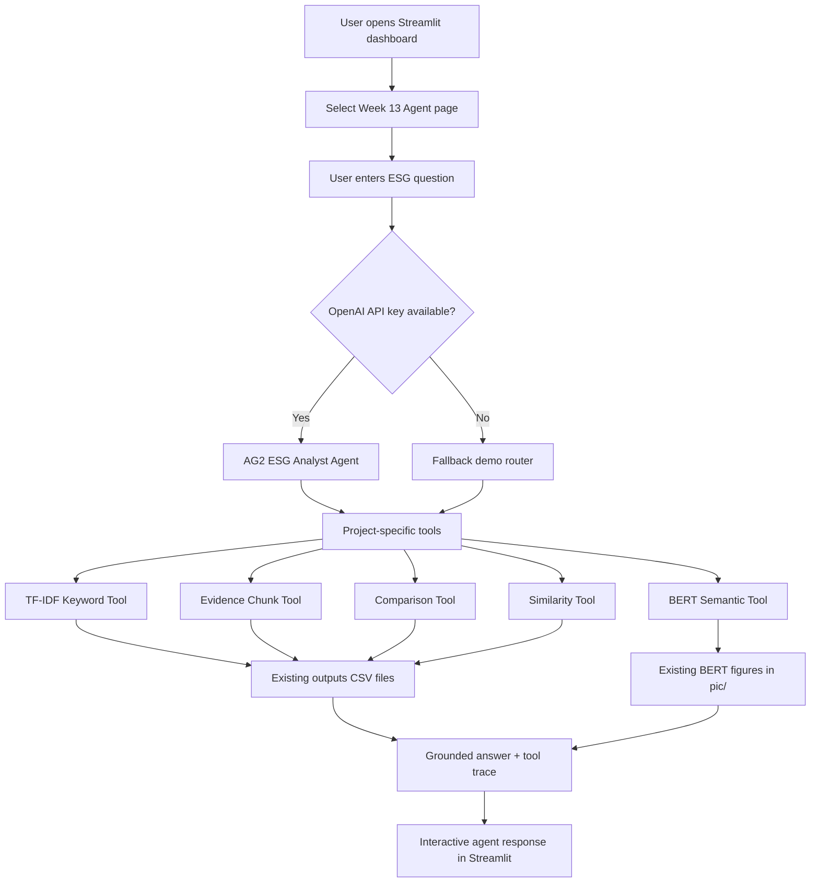
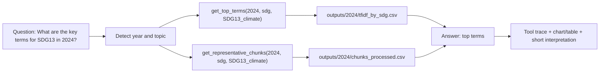

# Week 13 Agent Assignment Plan

## Assignment Goal

This week's assignment asks the group to connect the final project with agent techniques.

This note documents the agent built for this week's assignment:

1. A working tool-using agent connected to the final project data.
2. A short discussion of how agents and tools could further benefit the final project.

For this repository, the safest and clearest approach is to build a small **TSMC ESG Agent Assistant** inside the existing Streamlit dashboard.

The agent should not replace the current pipeline. It should sit on top of the existing outputs and help users ask questions about TF-IDF keywords, representative evidence chunks, group comparison, and BERT-style semantic results.

The implementation should use a real agent framework, but stay isolated from the core project:

- **Agent framework:** AG2 / AutoGen-style tool agent.
- **LLM API:** OpenAI API.
- **Suggested model:** `gpt-5-mini` or another available low-cost OpenAI chat model.
- **UI:** existing Streamlit dashboard.
- **Fallback:** if AG2 or the API key is unavailable, the page still shows deterministic tool outputs.

---

## Current Repository Context

Useful files already exist:

- `app.py` - current Streamlit dashboard entry point.
- `app_pages/` - modular dashboard pages.
- `outputs/` - processed chunk, TF-IDF, similarity, and multi-year CSV outputs.
- `pic/` - existing experiment figures, including BERT and FinBERT figures.
- `records/BERT_EXPERIMENT_PLAN.md` - previous BERT experiment design.
- `records/BERT_EXPERIMENT_RESULTS.md` - previous BERT / FinBERT results and selected figures.
- `records/[W13] Group Assignment_Team9.pdf` - Week 13 assignment prompt.

The new Week 13 work should reuse these assets instead of creating a separate project.

---

## Recommended Agent Concept

Build a simple **tool-using ESG analysis agent**:

> The user asks a sustainability question. The agent routes the question to one or more analysis tools, retrieves evidence from the existing project outputs, and returns a short interpretation with supporting data.

Example user questions:

- What are the key terms for SDG13 in 2024?
- Show evidence chunks for the Talent section.
- Compare SDG12 and SDG13.
- Which SDGs are semantically similar according to BERT?
- What evidence supports the claim that TSMC emphasizes climate action?

This is enough for the assignment because it demonstrates:

- real agent-style question handling through AG2
- tool selection
- use of project data
- interpretable evidence

---

## Agent Architecture

Recommended architecture:

```text
User question in Streamlit
  -> AG2 ESG Analyst Agent
  -> registered project tools
  -> existing CSV / BERT outputs
  -> final answer + tool trace + evidence tables
```

The first implementation should be a **single-agent tool-calling demo**, not a complex multi-agent system. Multi-agent orchestration can be discussed as a future extension in Part 2.

The implementation should support two modes:

1. **AG2 mode**
   - Uses AG2 with an OpenAI model.
   - Agent selects tools and writes a short answer.
   - Requires API key.

2. **Fallback demo mode**
   - Uses the same tools with deterministic routing.
   - Lets the page run even without AG2 or API access.
   - Keeps the deployed dashboard usable when no API key is provided.

---

## Agent Tools

Suggested tools:

| Tool | Data Source | Purpose |
|---|---|---|
| TF-IDF Keyword Tool | `outputs/{year}/tfidf_by_sdg.csv`, `outputs/{year}/tfidf_by_section.csv` | Finds distinctive terms for an SDG or section |
| Evidence Chunk Tool | `outputs/{year}/chunks_processed.csv` | Shows representative text chunks |
| Comparison Tool | TF-IDF CSVs and chunk counts | Compares two SDGs or sections |
| Similarity Tool | `outputs/{year}/similarity_by_sdg.csv`, `outputs/{year}/similarity_by_section.csv` | Finds related SDGs or sections |
| BERT Semantic Tool | existing `pic/bert_*.png` and previous BERT results | Connects the agent demo to the earlier BERT experiment |

The AG2 agent should call these tools when possible. The fallback mode can use simple keyword matching:

- Detect year: `2022`, `2023`, `2024`
- Detect group type: `SDG`, `section`, `Talent`, `Environment`, etc.
- Detect intent: `keywords`, `evidence`, `compare`, `similarity`, `BERT`

---

## File-Level Change List

Minimum implementation:

- Add `src/agent_tools.py`
  - Tool functions for TF-IDF lookup, evidence retrieval, comparison, similarity, and BERT asset summaries.
  - These functions should not import Streamlit.

- Add `app_pages/week13_agent.py`
  - Streamlit UI for the Week 13 agent demo.
  - Local helper functions for loading outputs.
  - AG2 setup if dependencies and API key are available.
  - Agent response panel showing selected tools and generated interpretation.

- Modify `app.py`
  - Import `render_page` from `app_pages.week13_agent`.
  - Add `Week 13 Agent` to the dashboard navigation.

- Add `requirements_agent.txt`
  - Keep AG2 dependencies separate from the stable base dashboard requirements.

- Keep existing BERT files unchanged:
  - `records/BERT_EXPERIMENT_PLAN.md`
  - `records/BERT_EXPERIMENT_RESULTS.md`
  - `pic/bert_sdg_embedding_pca.png`
  - `pic/bert_sdg_similarity_heatmap.png`
  - `pic/bert_section_embedding_pca.png`
  - `pic/bert_section_similarity_heatmap.png`

Optional documentation:

- Add a short final write-up after implementation, possibly `records/WEEK13_AGENT_RESULTS.md`.

---

## Implemented Project Structure

The Week 13 agent is implemented as a small extension to the existing dashboard.

```text
tsmc-esg-wordcloud/
|-- app.py
|   `-- Adds "Week 13 Agent" to the Streamlit sidebar navigation
|-- app_pages/
|   |-- week13_agent.py
|   |   |-- Streamlit UI for the agent page
|   |   |-- OpenAI API key password input for deployed users
|   |   |-- AG2 agent setup
|   |   |-- fallback demo mode
|   |   `-- compact layout for the agent demo
|   |-- week9_q1.py
|   |-- week10_q2.py
|   `-- analysis.py
|-- src/
|   `-- agent_tools.py
|       |-- TF-IDF Keyword Tool
|       |-- Evidence Chunk Tool
|       |-- Comparison Tool
|       |-- Similarity Tool
|       `-- BERT Semantic Tool
|-- outputs/
|   |-- 2022/
|   |   |-- chunks_processed.csv
|   |   |-- tfidf_by_sdg.csv
|   |   |-- tfidf_by_section.csv
|   |   |-- similarity_by_sdg.csv
|   |   `-- similarity_by_section.csv
|   |-- 2023/
|   `-- 2024/
|-- pic/
|   |-- bert_sdg_embedding_pca.png
|   |-- bert_sdg_similarity_heatmap.png
|   |-- bert_section_embedding_pca.png
|   `-- bert_section_similarity_heatmap.png
|-- records/
|   |-- BERT_EXPERIMENT_PLAN.md
|   `-- BERT_EXPERIMENT_RESULTS.md
|-- mds/
|   `-- WEEK13_AGENT_PLAN.md
`-- requirements_agent.txt
    `-- Extra AG2 / OpenAI dependencies for the agent page
```

The core pipeline remains unchanged. The agent only reads existing outputs and figures.

---

## Agent Flow



Interpretation:

- AG2 provides the agent framework and tool-calling behavior.
- The project tools provide reliable evidence from existing TSMC ESG outputs.
- The fallback path keeps the deployed dashboard usable even without an API key.

---

## How the Agent Uses Project Data



Example output:

```text
Question interpreted: What are the key terms for SDG13 in 2024?

Agent answer:
- TF-IDF Keyword Tool for SDG13_climate: supplier, carbon, emission, climate, supply, chain
- Evidence Chunk Tool for SDG13_climate: Retrieved 3 representative chunks for SDG13_climate.

Interpretation:
The agent uses project-specific tools instead of guessing from memory, so the response is grounded in existing TSMC ESG analysis outputs.
```

---

## Implementation Steps

### Step 1: Create the Tool Module and Streamlit Page

Create:

- `src/agent_tools.py`
- `app_pages/week13_agent.py`

The page should include:

- Page title: `Week 13: ESG Agent Assistant`
- Short explanation of AG2 + project tools
- Query input box
- Year selector
- Example query buttons or dropdown
- Agent output area
- Tool trace area showing which tools were used
- API / AG2 availability status

The page should feel like a demonstration, not a production chatbot.

### Step 2: Build Data Loaders

Load year-specific outputs with `pathlib`.

Expected files:

- `outputs/2022/chunks_processed.csv`
- `outputs/2023/chunks_processed.csv`
- `outputs/2024/chunks_processed.csv`
- `outputs/2022/tfidf_by_sdg.csv`
- `outputs/2023/tfidf_by_sdg.csv`
- `outputs/2024/tfidf_by_sdg.csv`
- `outputs/2022/tfidf_by_section.csv`
- `outputs/2023/tfidf_by_section.csv`
- `outputs/2024/tfidf_by_section.csv`
- `outputs/2022/similarity_by_sdg.csv`
- `outputs/2023/similarity_by_sdg.csv`
- `outputs/2024/similarity_by_sdg.csv`

If a file is missing, show a Streamlit warning instead of crashing.

### Step 3: Implement Agent Tools

Implement small functions:

- `get_top_terms(year, group_type, group_name, top_n=10)`
- `get_representative_chunks(year, group_type, group_name, top_n=3)`
- `compare_groups(year, group_type, group_a, group_b)`
- `get_similarity_neighbors(year, group_type, group_name, top_n=5)`
- `get_bert_assets()`

Keep each function narrow and easy to explain.

### Step 4: Implement AG2 Agent Setup and Fallback Router

AG2 mode should:

- Create an ESG analyst agent.
- Register project tool functions.
- Ask the agent to answer using only the tool outputs.
- Show the response and tool trace in Streamlit.

Fallback mode should inspect the user query and decide which tools to call.

Example routing:

- Query contains `compare` or `vs`: call comparison tool.
- Query contains `evidence`, `chunk`, or `example`: call evidence tool.
- Query contains `similar`, `similarity`, or `BERT`: call similarity / BERT tool.
- Otherwise: call TF-IDF keyword tool and evidence tool.

The response should show:

- interpreted question
- selected year
- tools used
- key findings
- evidence table or chart

### Step 5: Connect the Page to `app.py`

Add the page to the existing Streamlit navigation.

Suggested label:

`Week 13 Agent`

---

## How to Execute

Run the dashboard:

```powershell
streamlit run app.py
```

Optional agent dependency setup:

```powershell
pip install -r requirements_agent.txt
```

Set an API key before running AG2 mode:

```powershell
$env:OPENAI_API_KEY="your_api_key_here"
```

For Streamlit Cloud deployment, the Week 13 Agent page supports a safer user-provided key flow:

- Users can paste their own OpenAI API key into the page's password input.
- The key is used only for the current Streamlit session.
- If the field is blank, the app tries Streamlit secrets.
- If no key is available, the page falls back to deterministic demo mode.

Recommended deployed-app note:

> To run AG2 mode, paste your own OpenAI API key into the password field. The key is used only for this browser session and is not committed to GitHub. Without a key, the page still works in fallback demo mode.

Then open the Streamlit app and select:

```text
Week 13 Agent
```

Run the example queries to verify that the agent can call project tools and return evidence-based answers.

If using the existing approved local command, the app may also be launched with the existing hidden Streamlit process configuration for this repository.

---

## How to Use the Week 13 Agent Page

### Local Use

1. Install the base dashboard dependencies.

```powershell
pip install -r requirements.txt
```

2. Install the optional agent dependencies.

```powershell
pip install -r requirements_agent.txt
```

3. Run Streamlit.

```powershell
streamlit run app.py
```

4. Open the sidebar page:

```text
Week 13 Agent
```

5. Either paste an OpenAI API key into the page's password field or leave it blank to use fallback demo mode.

### Streamlit Cloud Deployment

The deployed app supports two key modes:

1. **User-provided key**
   - The user pastes their own OpenAI API key into the password input.
   - The key is used only for that Streamlit browser session.
   - The key is not committed to GitHub.

2. **Fallback demo mode**
   - If no key is provided, the page still works.
   - It uses deterministic project tools to retrieve TF-IDF terms, evidence chunks, similarity results, and BERT asset summaries.

Optional owner-provided key:

- The app owner can also set `OPENAI_API_KEY` in Streamlit Cloud secrets.
- This makes AG2 mode work without asking users for a key.
- For public links, user-provided keys are safer because they do not spend the owner's quota.

Recommended deployed-app instruction:

```text
To run AG2 mode, paste your own OpenAI API key into the password field.
The key is used only for this browser session.
Without a key, the page still works in fallback demo mode.
```

### Example Queries

Use these queries to test the agent:

```text
What are the key terms for SDG13 in 2024?
Show evidence chunks for Talent section in 2024.
Compare SDG12 and SDG13 in 2024.
Which SDGs are semantically similar according to BERT?
List available BERT semantic assets.
```

---

## Part 1 Write-Up Draft

Suggested wording:

> We built a simple tool-using ESG analysis agent for our TSMC sustainability report dashboard. The agent uses AG2, an AutoGen-style open-source agent framework, with an OpenAI language model. It receives a user question, selects project-specific tools, retrieves TF-IDF keywords, representative report chunks, cross-group comparisons, similarity scores, and BERT-style semantic visualizations from our existing analysis outputs, then produces a short evidence-based answer. The goal is not to replace the dashboard, but to make the analysis easier to query and explain.

For BERT connection:

> The agent also connects to our previous BERT experiment. We use BERT-style semantic outputs, including PCA maps and similarity heatmaps, to show that some ESG categories are related by meaning even when their exact keywords differ. This complements the TF-IDF baseline with semantic evidence.

---

## Part 2: Five Future Agent Ideas

### 1. Evidence Retrieval Agent

This agent would automatically retrieve the most relevant report chunks for any ESG claim.

Benefit:

- Helps support dashboard insights with original text evidence.
- Makes the final presentation more defensible.

Example:

> User asks: "Why do we say TSMC emphasizes climate action?" The agent returns SDG13 keywords and representative report chunks.

### 2. Cross-Year Comparison Agent

This agent would compare the same SDG or section across 2022, 2023, and 2024.

Benefit:

- Helps identify whether TSMC's ESG language changes over time.
- Supports the final project's multi-year direction.

Example:

> User asks: "How did SDG13 climate language change from 2022 to 2024?"

### 3. Presentation Script Agent

This agent would convert charts and findings into short speaking notes.

Benefit:

- Helps teammates explain each chart clearly in 20 to 30 seconds.
- Improves demo flow and presentation readiness.

Example:

> User selects a TF-IDF chart. The agent generates a short interpretation for the presenter.

### 4. Data Quality Audit Agent

This agent would inspect processed chunks and labels for possible data problems.

Benefit:

- Finds duplicated chunks, missing section labels, weak SDG labels, OCR noise, or stopword leakage.
- Improves reproducibility and reliability.

Example:

> User asks: "Check whether the 2024 chunks have missing SDG labels."

### 5. Research Question Agent

This agent would help translate broad ESG questions into executable text-mining queries.

Benefit:

- Helps users interact with the project without knowing the internal file structure.
- Bridges the gap between research goals and dashboard controls.

Example:

> User asks: "Is TSMC's sustainability language more about innovation or labor?" The agent maps the question to SDG9, SDG8, section labels, TF-IDF comparison, and evidence chunks.

---

## Validation Steps

Before considering the Week 13 work done:

- Run `streamlit run app.py`.
- Confirm the app starts without import errors.
- Open the `Week 13 Agent` page.
- Confirm the page clearly shows whether AG2 mode or fallback mode is active.
- Test at least 4 queries:
  - SDG keyword query
  - section evidence query
  - SDG comparison query
  - BERT / similarity query
- Confirm the page handles missing files gracefully.

---

## Low-Risk / Rollback Note

This plan is low-risk because it does not modify the existing preprocessing pipeline, BERT experiment scripts, or output CSV format. AG2 dependencies are kept in `requirements_agent.txt` so the base dashboard environment remains stable.

Rollback is simple:

- Remove `src/agent_tools.py`.
- Remove `app_pages/week13_agent.py`.
- Remove the `Week 13 Agent` import and navigation entry from `app.py`.
- Ignore or remove `requirements_agent.txt`.

The existing dashboard and BERT experiment records should remain unchanged.

---

## Definition of Done

The Week 13 assignment is done when:

- A Streamlit `Week 13 Agent` page exists.
- The AG2 agent, or its fallback demo mode, can answer simple ESG questions using existing outputs.
- The page shows which tools were used.
- The BERT experiment is connected as a semantic tool or visual evidence.
- 5 future agent/tool examples are written for Part 2.
- The implementation can be explained in under one minute.
